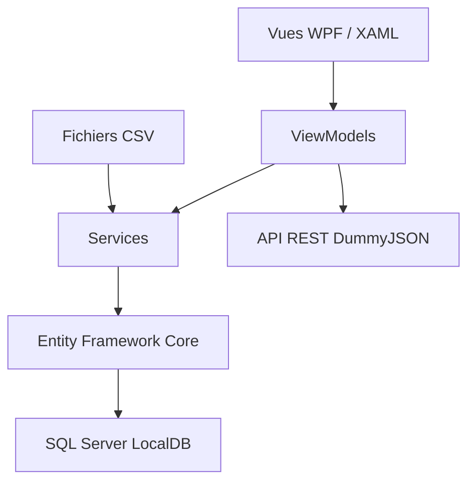

# Système de gestion de garage automobile

[](https://github.com/papaboye/SystemeDeGestionGarageMVVM/actions/workflows/build.yml)
[](https://dotnet.microsoft.com/)
[](https://learn.microsoft.com/dotnet/desktop/wpf/)

Application de bureau Windows développée en **C#** avec **WPF** et une organisation **MVVM**. Elle permet de gérer le stock d'un garage automobile, les utilisateurs, les demandes de réparation, les devis et les factures.

Ce projet a été réalisé dans un contexte académique afin de mettre en pratique la conception d'une application de bureau, la persistance des données avec Entity Framework Core, l'importation de fichiers CSV et la consommation d'une API REST.

## Aperçu

L'application démarre sur une fenêtre de connexion. Après authentification, l'espace de travail est déterminé automatiquement par le rôle du compte : propriétaire, fournisseur ou client.

Le projet couvre notamment :

- la gestion CRUD des véhicules, des pièces et des utilisateurs;
- la consultation du catalogue par les clients;
- l'approvisionnement du stock par un fournisseur;
- la création d'une demande de réparation;
- le calcul d'un devis à partir du prix d'une pièce et de la main-d'œuvre;
- la génération d'une facture lorsqu'un devis de réparation est accepté;
- l'initialisation automatique d'une base SQL Server LocalDB à partir de données de démonstration.

## Fonctionnalités par rôle

### Propriétaire

- consulter le stock des véhicules et des pièces;
- ajouter, modifier et supprimer des véhicules;
- ajouter, modifier et supprimer des pièces;
- ajouter, modifier et supprimer des utilisateurs;
- contrôler les données saisies : VIN unique, prix, kilométrage, année et dates valides.

### Fournisseur

- consulter le stock des véhicules;
- consulter le stock des pièces;
- ajouter une voiture au stock;
- ajouter une pièce au stock;
- empêcher les doublons de VIN et de pièces.

### Client

- consulter les véhicules disponibles;
- rechercher un véhicule et générer un devis d'achat;
- consulter le catalogue des pièces;
- soumettre une demande de réparation;
- sélectionner une voiture et une pièce pour la demande;
- consulter l'historique des réparations.

### Cycle réparation, devis et facture

Pour une demande de réparation, l'application :

1. vérifie les informations saisies et les éléments sélectionnés;
2. calcule le montant du devis;
3. affiche le devis au client;
4. enregistre la réparation et le devis;
5. génère automatiquement une facture si le devis est accepté.

Le calcul actuel utilise le prix de la pièce sélectionnée et une main-d'œuvre fixe de **200**. Le mode de paiement de démonstration est « Espèces ».

## Architecture

Le projet utilise une organisation MVVM pragmatique : les vues XAML décrivent l'interface, les ViewModels portent l'état et les opérations de présentation, tandis que les modèles représentent les données du garage.



Au démarrage :

1. les migrations Entity Framework Core sont appliquées;
2. la base `TP2DB` est créée si nécessaire;
3. les véhicules et les pièces des fichiers CSV sont importés;
4. les doublons sont évités grâce au VIN des véhicules et au nom des pièces;
5. les comptes de démonstration sont chargés depuis DummyJSON.

La documentation technique détaillée se trouve dans [docs/ARCHITECTURE.md](docs/ARCHITECTURE.md).

## Technologies utilisées

| Technologie | Utilisation |
| --- | --- |
| C# / .NET 8 | Langage et plateforme d'exécution |
| WPF / XAML | Interface graphique Windows |
| MVVM | Séparation de l'interface et de la logique de présentation |
| Entity Framework Core 9 | Accès aux données et migrations |
| SQL Server Express LocalDB | Base de données locale |
| CsvHelper | Lecture des fichiers CSV |
| Newtonsoft.Json | Désérialisation des réponses JSON |
| HttpClient | Appel de l'API REST |
| GitHub Actions | Compilation continue sur Windows |

## Prérequis

- Windows 10 ou Windows 11;
- [.NET 8 SDK](https://dotnet.microsoft.com/download/dotnet/8.0);
- SQL Server Express LocalDB, généralement installé avec Visual Studio;
- une connexion Internet lors de la connexion, afin de charger les comptes DummyJSON.

## Installation et exécution

```powershell
git clone https://github.com/papaboye/SystemeDeGestionGarageMVVM.git
cd SystemeDeGestionGarageMVVM

dotnet restore
dotnet build TravailPratique2.csproj --configuration Release
dotnet run --project TravailPratique2.csproj
```

Le projet cible Windows (`net8.0-windows`) et ne peut donc pas être exécuté comme application graphique WPF sur Linux ou macOS.

Les fichiers `vehicules_db.csv` et `reparations_db.csv` sont copiés automatiquement dans le dossier de sortie pendant la compilation. Le nom `reparations_db.csv` est conservé pour respecter la structure du projet initial; il contient le catalogue des pièces utilisé par l'application.

## Connexion de démonstration

La fenêtre de connexion récupère les utilisateurs depuis [DummyJSON](https://dummyjson.com/docs/users). Le rôle retourné par l'API ouvre automatiquement l'espace correspondant :

| Rôle API | Espace ouvert |
| --- | --- |
| `admin` | Propriétaire |
| `moderator` | Fournisseur |
| `user` | Client |

Pour tester l'application, utiliser les identifiants d'un utilisateur de démonstration renvoyé par l'API [DummyJSON](https://dummyjson.com/users). Les utilisateurs ajoutés depuis l'espace propriétaire sont enregistrés dans la base locale pour la gestion interne du garage; la connexion de démonstration actuelle s'appuie sur les comptes chargés par l'API.

## Structure du dépôt

```text
.
├── Models/                 Entités métier et contexte Entity Framework
├── View/                   Fenêtres et interfaces WPF
├── ViewModels/             État et logique de présentation
├── Services/               Initialisation de la base et services métier
├── Migrations/             Migrations Entity Framework Core
├── docs/                   Documentation technique
├── vehicules_db.csv        Données fictives initiales des véhicules
├── reparations_db.csv      Données fictives initiales des pièces
├── TravailPratique2.csproj Fichier projet .NET
└── .github/workflows/      Compilation GitHub Actions
```

## Intégration continue

Le workflow [`.github/workflows/build.yml`](.github/workflows/build.yml) :

- s'exécute sur un environnement Windows;
- restaure les dépendances .NET;
- compile le projet en configuration `Release`;
- s'exécute sur les branches `master` et `portfolio-cleanup`, ainsi que sur les Pull Requests vers `master`.

## Limites connues et prochaines évolutions

- l'application est limitée à Windows et à SQL Server Express LocalDB;
- l'authentification DummyJSON est uniquement destinée à la démonstration;
- les mots de passe et les données de comptes locaux ne sont pas encore protégés comme dans une application de production;
- le rôle vendeur n'est pas encore implémenté;
- l'achat d'une voiture génère actuellement un devis de démonstration, sans gestion complète de la transaction et de la diminution du stock;
- la main-d'œuvre est actuellement une valeur fixe;
- certaines actions d'interface restent dans le code-behind et pourraient être déplacées vers des commandes MVVM;
- des tests unitaires et des tests d'interface restent à ajouter.

## Auteur

**Papa Alioune Boye**

Étudiant à la maîtrise en informatique — UQAR
